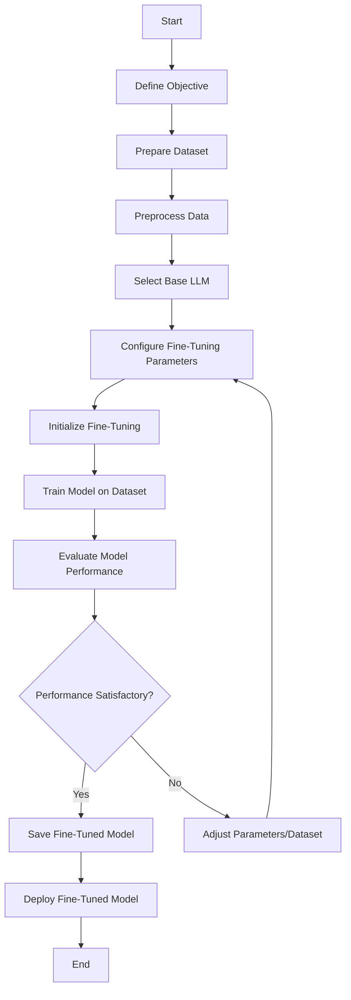

# Answers

## unsloth.ai opensource alternatives

1. [Axolotl](https://axolotl-ai-cloud.github.io/axolotl/) - A flexible fine-tuning framework supporting multiple model architectures and training approaches. Particularly good for LoRA and QLoRA fine-tuning.

2. [PEFT (Parameter Efficient Fine-Tuning)](https://github.com/huggingface/peft) by Hugging Face - Offers various efficient fine-tuning methods including LoRA, Prefix Tuning, and P-Tuning.

3. [LightningAI's lit-gpt](https://github.com/Lightning-AI/litgpt) - Clean implementation for training and fine-tuning transformers, with support for quantization and efficient training methods.

4. [TRL (Transformer Reinforcement Learning)](https://github.com/huggingface/trl) - Specifically focused on RLHF and instruction fine-tuning of language models.

5. [FastChat](https://github.com/lm-sys/FastChat) - Known for training ChatGLM models, includes tools for fine-tuning and deployment.

The main trade-offs compared to unsloth.ai:
- These alternatives typically require more manual optimization
- May need more computational resources
- Often have steeper learning curves
- But offer more flexibility and transparency in the fine-tuning process

## Is there a way to use OpenAI or Anthropic's API to finetune local models

OpenAI and Anthropic's APIs don't allow for local fine-tuning - the training process happens on their servers, which means your training data must be uploaded to their cloud infrastructure.

For truly local fine-tuning where your data never leaves your infrastructure, you would need to:

1. Use open source models like:
- Llama 2
- Mistral
- Pythia
- BLOOM
- GPT-NEO

2. Use local fine-tuning frameworks like:
- Axolotl 
- PEFT/Transformers by HuggingFace
- lit-gpt by Lightning AI
- H2O-LLM-Studio

These options ensure your training data stays within your control, though they require more technical setup and computational resources compared to API-based solutions.

## Explain more about setting up a secure local fine-tuning environment with any of these alternatives

```bash
# 1. Create an isolated environment
conda create -n secure-finetune python=3.10
conda activate secure-finetune

# 2. Install core dependencies
pip install torch torchvision torchaudio --index-url https://download.pytorch.org/whl/cu118
pip install transformers datasets accelerate bitsandbytes
pip install wandb  # for experiment tracking (optional)
pip install git+https://github.com/huggingface/peft.git
pip install sentencepiece

# 3. Set up data security measures
# Create isolated directory structure
mkdir -p ~/secure-ft/{data,models,outputs}
chmod 700 ~/secure-ft  # Restrict permissions

# 4. Create config for data preprocessing
cat << EOF > ~/secure-ft/data_config.py
TRAINING_DATA_PATH = "~/secure-ft/data/training.jsonl"
MODEL_OUTPUT_PATH = "~/secure-ft/models"
BASE_MODEL_NAME = "Qwen/Qwen2.5-Coder-32B-Instruct"
EOF

# 5. Set up environment variables for security
export TRANSFORMERS_CACHE="~/secure-ft/cache"
export HF_HOME="~/secure-ft/hf-home"
export WANDB_MODE="offline"  # Prevent data logging to external services

```

```python
import os
import torch
from transformers import (
    AutoModelForCausalLM,
    AutoTokenizer,
    TrainingArguments,
    Trainer,
    DataCollatorForLanguageModeling,
)
from peft import LoraConfig, get_peft_model
from datasets import load_dataset

def setup_security_measures():
    """Configure security settings for training"""
    # Disable telemetry
    os.environ["WANDB_MODE"] = "offline"
    os.environ["HF_HUB_OFFLINE"] = "1"
    
    # Verify isolated environment
    training_dir = os.path.expanduser("~/secure-ft")
    assert os.path.exists(training_dir), "Secure directory not found"
    assert os.stat(training_dir).st_mode & 0o777 == 0o700, "Incorrect permissions"

def load_model_for_training(model_name, device_map="auto"):
    """Load model with quantization for efficient training"""
    model = AutoModelForCausalLM.from_pretrained(
        model_name,
        load_in_4bit=True,
        device_map=device_map,
        torch_dtype=torch.float16,
    )
    
    # Configure LoRA
    lora_config = LoraConfig(
        r=16,
        lora_alpha=32,
        target_modules=["q_proj", "k_proj", "v_proj", "o_proj"],
        lora_dropout=0.05,
        bias="none",
        task_type="CAUSAL_LM"
    )
    
    model = get_peft_model(model, lora_config)
    return model

def prepare_training_args():
    """Set up training configuration"""
    return TrainingArguments(
        output_dir="~/secure-ft/outputs",
        num_train_epochs=3,
        per_device_train_batch_size=4,
        gradient_accumulation_steps=4,
        save_steps=100,
        logging_steps=10,
        learning_rate=2e-4,
        fp16=True,
        optim="paged_adamw_32bit",
        report_to=[],  # Disable external reporting
    )

def main():
    setup_security_measures()
    
    # Load tokenizer and model
    tokenizer = AutoTokenizer.from_pretrained(
        "Qwen/Qwen2.5-Coder-32B-Instruct",
        trust_remote_code=True
    )
    model = load_model_for_training("Qwen/Qwen2.5-Coder-32B-Instruct")
    
    # Load and preprocess dataset
    dataset = load_dataset("json", data_files="~/secure-ft/data/training.jsonl")
    
    # Initialize trainer
    trainer = Trainer(
        model=model,
        train_dataset=dataset["train"],
        args=prepare_training_args(),
        data_collator=DataCollatorForLanguageModeling(tokenizer, mlm=False),
    )
    
    # Start training
    trainer.train()
    
    # Save the final model
    trainer.save_model("~/secure-ft/models/final")

if __name__ == "__main__":
    main()

```

Here's how to use this secure setup:

1. **Security Measures**:
   - Isolated conda environment prevents dependency conflicts
   - Restricted directory permissions (700) prevent unauthorized access
   - Disabled telemetry and external logging
   - Offline mode prevents unintended data transmission

2. **Data Handling**:
   - Keep training data in the isolated directory
   - Use local file storage only
   - Implement access controls at the OS level
   - Regular backups to secure storage

3. **Training Process**:
   - Uses QLoRA for efficient training on consumer hardware
   - Implements gradient checkpointing to reduce memory usage
   - Saves regular checkpoints for recovery
   - Monitors resource usage and training progress locally

4. **Best Practices**:
   - Run on an isolated machine or network segment
   - Use full disk encryption
   - Regular security audits of the environment
   - Monitor network traffic during training
   - Keep system and dependencies updated

To get started:

1. Copy both scripts to your secure environment
2. Run the setup commands from the first script
3. Place your training data in `~/secure-ft/data/training.jsonl`
4. Run the training script: `python train.py`

The setup handles most GPUs automatically through PyTorch's device mapping. For multi-GPU setups, the training script will automatically utilize all available GPUs through PyTorch's DistributedDataParallel.

## What are the steps in the fine tuning process?

1. Data Preparation
- Clean and format your training data
- Create input/output pairs in the required format
- Validate data quality and consistency
- Most importantly: Keep this data on your local infrastructure

2. Model Selection
- Choose an open-source base model you can run locally (like Llama 2, Mistral)
- Select a model size that fits your hardware capabilities
- Ensure you have the proper licenses for commercial use if needed

3. Training Setup
- Choose a fine-tuning method (LoRA, QLoRA, full fine-tuning)
- Set up your local GPU environment
- Install required frameworks (PyTorch, transformers, etc.)
- Configure hyperparameters (learning rate, batch size, etc.)

4. Training Process
- Run the fine-tuning locally on your hardware
- Monitor training metrics
- Save checkpoints regularly
- This is where your data stays completely under your control

5. Evaluation
- Test the model on held-out validation data
- Compare performance metrics
- Check for overfitting or other issues

6. Deployment
- Host the model on your own infrastructure
- Set up inference endpoints if needed
- Maintain full control over both model and data

## Suppose I want to fine tune model "Qwen/Qwen2.5-Coder-32B-Instruct" locally, what are the hardware requirements?

Minimum Requirements:
- GPU VRAM: At least 2-3 80GB A100 GPUs for full fine-tuning
- System RAM: 256GB+ recommended
- Storage: 200GB+ fast SSD storage for model weights and training data

However, you can reduce these requirements significantly using optimization techniques:

1. QLoRA (Quantized Low-Rank Adaptation):
- Can run on a single 24GB or 32GB GPU (like RTX 4090 or A5000)
- Requires around 32-48GB system RAM
- Uses 4-bit quantization to reduce memory footprint
- Maintains most of the performance of full fine-tuning

2. LoRA with 8-bit quantization:
- Can run on 2x RTX 4090 or similar
- Requires around 64GB system RAM
- Slightly better performance than QLoRA but more resource intensive

Recommended Setup for Production:
- 2-4 NVIDIA A100 80GB GPUs
- 256GB+ System RAM
- NVMe SSD storage
- Ubuntu 22.04 or similar Linux OS
- CUDA 11.8 or newer

## Give me a simple example "what is a training data" have example = text or json or any suitable format is up to you

A simple example of training data for fine-tuning using the JSONL (JSON Lines) format, which is commonly used for its simplicity and efficiency. Let's create a simple coding assistant that helps with Python documentation.

```json
{"instruction": "Write a docstring for this Python function:\ndef calculate_bmi(weight, height):\n    return weight / (height ** 2)", "response": "def calculate_bmi(weight, height):\n    \"\"\"Calculate the Body Mass Index (BMI) of a person.\n    \n    Args:\n        weight (float): Weight of the person in kilograms\n        height (float): Height of the person in meters\n    \n    Returns:\n        float: The BMI value calculated as weight/(height^2)\n    \n    Example:\n        >>> calculate_bmi(70, 1.75)\n        22.86\n    \"\"\"\n    return weight / (height ** 2)"}
{"instruction": "Document this Python function:\ndef merge_dicts(dict1, dict2):\n    result = dict1.copy()\n    result.update(dict2)\n    return result", "response": "def merge_dicts(dict1, dict2):\n    \"\"\"Merge two dictionaries into a new dictionary.\n    \n    Args:\n        dict1 (dict): First dictionary to merge\n        dict2 (dict): Second dictionary to merge\n    \n    Returns:\n        dict: A new dictionary containing all key-value pairs from both input dictionaries.\n              If a key exists in both dictionaries, the value from dict2 takes precedence.\n    \n    Example:\n        >>> merge_dicts({'a': 1, 'b': 2}, {'b': 3, 'c': 4})\n        {'a': 1, 'b': 3, 'c': 4}\n    \"\"\"\n    result = dict1.copy()\n    result.update(dict2)\n    return result"}
{"instruction": "Write documentation for this function:\ndef filter_even_numbers(numbers):\n    return [x for x in numbers if x % 2 == 0]", "response": "def filter_even_numbers(numbers):\n    \"\"\"Filter a list of numbers and return only the even numbers.\n    \n    Args:\n        numbers (list): A list of integers to filter\n    \n    Returns:\n        list: A new list containing only the even numbers from the input list\n    \n    Example:\n        >>> filter_even_numbers([1, 2, 3, 4, 5, 6])\n        [2, 4, 6]\n    \"\"\"\n    return [x for x in numbers if x % 2 == 0]"}
{"instruction": "Add documentation to this Python code:\ndef is_palindrome(text):\n    clean_text = ''.join(c.lower() for c in text if c.isalnum())\n    return clean_text == clean_text[::-1]", "response": "def is_palindrome(text):\n    \"\"\"Check if a given text is a palindrome.\n    \n    This function removes all non-alphanumeric characters and converts\n    the text to lowercase before checking if it reads the same\n    forwards and backwards.\n    \n    Args:\n        text (str): The text to check\n    \n    Returns:\n        bool: True if the text is a palindrome, False otherwise\n    \n    Example:\n        >>> is_palindrome('A man, a plan, a canal: Panama')\n        True\n        >>> is_palindrome('race a car')\n        False\n    \"\"\"\n    clean_text = ''.join(c.lower() for c in text if c.isalnum())\n    return clean_text == clean_text[::-1]"}

```

Key points about this training data:

1. **Format Structure**:
   - Each line is a valid JSON object
   - Each example has an "instruction" and "response" pair
   - The format is consistent across all examples

2. **Content Pattern**:
   - Input: Raw function without documentation
   - Output: Same function with proper docstring
   - Consistent docstring style (Args, Returns, Example sections)

3. **Data Variety**:
   - Different types of functions (calculations, data structures, string operations)
   - Various complexity levels
   - Different types of parameters and return values

You can save this data in a `.jsonl` file and use it with the training script from the previous example. The model will learn to:
1. Understand different types of Python functions
2. Generate appropriate documentation
3. Follow consistent documentation style
4. Include relevant examples

## Most current LLM responses are based on supervised learning

where the model learns from question-answer pairs that have been labeled/verified by humans. 
Your observation about potential wrong labeling is a significant concern in AI training, known as "data poisoning" or "training data pollution."

1. Intentional Mislabeling:
- Someone could deliberately pair questions with incorrect answers
- Example: Labeling "What is 2+2?" with "5" as the correct answer
- This could teach the model systematically wrong information

2. Quality Control Issues:
- Human annotators might make mistakes
- Different experts might disagree on correct answers
- Cultural or contextual biases in labeling

3. Cascading Effects:
- Wrong training data → Wrong model learning
- Model confidently giving incorrect answers
- Propagation of misinformation

Protection Methods:
1. Data Validation
- Multiple expert reviews
- Cross-checking with reliable sources
- Statistical anomaly detection

2. Training Safeguards
- Using diverse data sources
- Validation sets to catch obvious errors
- Regular model evaluation against known-good test cases

3. Fine-tuning Specific:
- When you fine-tune locally, you have complete control over training data quality
- You can implement your own verification process
- You can ensure domain experts verify the training pairs

##  Is the LLM model has reasoning (inference) ability or simply it has many values ​​for 1 key

The nature of LLM intelligence!

1. Not Just a Q&A Dictionary because:
- LLMs can generalize to questions they've never seen before
- They can combine concepts from different domains
- They can reason step-by-step through novel problems
- They can understand context and nuance

2. Why Answers Vary:
- The model uses "stochastic" (random) sampling during generation
- Each token (word/piece) is predicted probabilistically
- Different "paths" through the probability space create different but valid responses
- Think of it like different ways a human might explain the same concept

3. Evidence of Reasoning vs Memorization:
- Can solve new math problems it wasn't trained on
- Can analyze novel situations using learned principles
- Can apply knowledge in creative ways
- Can explain its thinking process

A helpful analogy: Think of it like human education. When we learn math, we don't memorize every possible equation - we learn principles that we can apply to new problems. LLMs do something similar, but through statistical pattern recognition rather than human-like consciousness.

BUT - and this is important - while LLMs show impressive reasoning capabilities, they're still fundamentally pattern matching machines. They don't have true understanding or consciousness. They're extremely sophisticated statistical models that can generate human-like text and perform reasoning-like operations, but they're not "intelligent" in the way humans are.

## How LLMs learn beyond simple one-to-one matching:

1. Token-Level Learning (Not Just Full Q&A Pairs):
- The model doesn't just learn whole question-answer pairs
- It learns patterns at the word/token level
- It learns relationships between concepts
- Example: If it learns about Python docstrings from multiple examples, it can understand:
  * Parameter documentation patterns
  * Return value descriptions
  * How to format example code
  * When to use different documentation styles

2. Pattern Recognition Across Examples:
- From: "def calculate_bmi(weight, height)" example
- And: "def merge_dicts(dict1, dict2)" example
- The model learns:
  * How to handle different parameter types
  * Common documentation structures
  * When to include examples
  * How to describe function purposes

3. Cross-Contextual Learning:
- Training data contains millions of related examples
- Model learns to connect concepts across domains
- Can combine knowledge from different contexts
- Example: Documentation + Python syntax + English grammar

So when you create training data:
- You provide ONE good example per case
- But the model learns the PATTERNS, not just memorizes
- It can then generate new, different, but valid responses
- Quality matters more than quantity of identical answers

Think of it like teaching a student:
- You don't need to show every possible way to solve 2+2
- Teaching the concept of addition lets them solve new problems
- The student learns patterns, not just memorizes answers

## How the model can generate varied responses despite having single examples in training data?

```json
{
    "training_examples": [
        {
            "question": "Write a function to calculate area of a rectangle",
            "answer": "def calculate_rectangle_area(length, width):\n    return length * width"
        },
        {
            "question": "Write a function to calculate area of a circle",
            "answer": "def calculate_circle_area(radius):\n    return 3.14 * radius * radius"
        }
    ],
    "learned_patterns": {
        "function_naming": {
            "pattern": "calculate_X_area",
            "learned": "Function names follow 'calculate_[shape]_area' pattern"
        },
        "parameter_handling": {
            "pattern": "Take measurements as parameters",
            "learned": "Functions accept dimension parameters needed for area calculation"
        },
        "calculation_structure": {
            "pattern": "Mathematical formula implementation",
            "learned": "Convert geometric formulas into code operations"
        }
    },
    "new_capability_example": {
        "unseen_question": "Write a function to calculate area of a triangle",
        "possible_response_1": "def calculate_triangle_area(base, height):\n    return 0.5 * base * height",
        "possible_response_2": "def calculate_triangle_area(base, height):\n    # Calculate area using base and height\n    area = (base * height) / 2\n    return area",
        "possible_response_3": "def calculate_triangle_area(a, b, c):\n    # Using Heron's formula for three sides\n    s = (a + b + c) / 2\n    return (s * (s-a) * (s-b) * (s-c)) ** 0.5"
    }
}

```

Here's how the model learns to generate varied responses:

1. **Pattern Recognition**:
   - From `calculate_rectangle_area` and `calculate_circle_area`, it learns:
     * Function naming conventions
     * Parameter patterns
     * Mathematical operation structures

2. **Concept Abstraction**:
   - Understands that area calculations:
     * Need appropriate measurements as inputs
     * Use mathematical formulas
     * Return numeric results

3. **Knowledge Combination**:
   - For the triangle area (unseen in training):
     * Can apply basic formula (base * height / 2)
     * Or use Heron's formula for three sides
     * Can include or omit comments
     * Can vary code style while maintaining correctness

4. **Contextual Generation**:
   - Same question can get different valid answers based on:
     * Different mathematical approaches
     * Different coding styles
     * Different levels of documentation
     * Different parameter choices

This is why when you ask the same question multiple times, you might get:
- Same core logic but different variable names
- Same solution but different documentation styles
- Different but equally valid mathematical approaches
- Different levels of code optimization

The model isn't just retrieving memorized answers - it's constructing responses by combining learned patterns and principles, similar to how a human programmer might approach problems differently each time while maintaining correctness.

## How LLMs generate code! The answer is nuanced:

1. **Not Direct Copying**
- The complete Snake game code is likely NOT stored exactly in the training data
- Instead, the model has learned from many examples of:
  * Game development patterns
  * PyGame usage
  * Reinforcement learning implementations
  * Snake game mechanics from different sources

2. **Component Learning**
From your image, I can break down what the model has learned:
- Left file: Snake game mechanics (PyGame patterns)
- Middle file: DQN implementation (PyTorch patterns)
- Right file: Training loop (RL patterns)

3. **Pattern Synthesis**
The model combines learned patterns:
- Game loops from various PyGame examples
- Neural network structures from PyTorch tutorials
- RL concepts from different implementations
- Snake game logic from various sources

4. **Cross-Language Translation**
When asked to code in another language:
- It doesn't just lookup "Snake in Java/C++/etc."
- It understands:
  * The core game logic concepts
  * The equivalent language constructs
  * How to structure similar patterns in different languages

Think of it like a programmer who has:
- Studied many codebases
- Learned programming patterns
- Can combine and adapt these patterns
- Can translate concepts between languages

That's why:
- Different prompts give slightly different but logically similar code
- The core logic stays consistent
- Variable names and structure might change
- But it's generating, not retrieving

It's more like having learned "how to program" rather than memorizing specific programs.

## How  LLMs combine knowledge and reason through problems, focusing on data validation techniques for web crawling data.

```python
from typing import Dict, List, Any, Optional
from datetime import datetime
import re
from pydantic import BaseModel, validator, Field
import pandas as pd

class ProductData(BaseModel):
    """Data model for scraped product information with validation."""
    
    product_id: str = Field(..., min_length=5, max_length=50)
    name: str = Field(..., min_length=1, max_length=200)
    price: float = Field(..., gt=0)
    description: Optional[str] = None
    url: str
    timestamp: datetime = Field(default_factory=datetime.now)
    
    @validator('product_id')
    def validate_product_id(cls, v):
        """Ensure product_id follows expected pattern."""
        if not re.match(r'^[A-Z]{2}\d{3,}$', v):
            raise ValueError('Product ID must start with 2 uppercase letters followed by numbers')
        return v
    
    @validator('price')
    def validate_price(cls, v):
        """Additional price validation beyond basic range check."""
        if v > 1000000:  # Suspicious price threshold
            raise ValueError('Price exceeds reasonable maximum')
        return round(v, 2)  # Standardize to 2 decimal places
    
    @validator('url')
    def validate_url(cls, v):
        """Validate URL format and domain."""
        if not re.match(r'https?://[\w\-\.]+\.\w+/\S*', v):
            raise ValueError('Invalid URL format')
        allowed_domains = ['example.com', 'store.example.com']
        domain = re.search(r'https?://([\w\-\.]+)', v).group(1)
        if domain not in allowed_domains:
            raise ValueError(f'Domain {domain} not in allowed list')
        return v

def validate_dataset(data: List[Dict[str, Any]]) -> pd.DataFrame:
    """Validate and clean a dataset of scraped products."""
    
    valid_records = []
    error_records = []
    
    for record in data:
        try:
            # Validate through Pydantic model
            validated = ProductData(**record)
            valid_records.append(validated.dict())
        except Exception as e:
            error_records.append({
                'record': record,
                'error': str(e)
            })
    
    # Convert to DataFrame for analysis
    df = pd.DataFrame(valid_records)
    
    # Statistical validation
    def detect_outliers(series):
        q1 = series.quantile(0.25)
        q3 = series.quantile(0.75)
        iqr = q3 - q1
        lower_bound = q1 - (1.5 * iqr)
        upper_bound = q3 + (1.5 * iqr)
        return (series < lower_bound) | (series > upper_bound)
    
    # Flag price outliers
    df['price_outlier'] = detect_outliers(df['price'])
    
    # Check for duplicate products
    df['is_duplicate'] = df.duplicated(subset=['product_id'], keep='first')
    
    # Add data quality score
    df['quality_score'] = 100
    df.loc[df['price_outlier'], 'quality_score'] -= 20
    df.loc[df['is_duplicate'], 'quality_score'] -= 30
    df.loc[df['description'].isna(), 'quality_score'] -= 10
    
    return df, error_records

# Example usage
def process_scraped_data(raw_data: List[Dict[str, Any]]):
    """Process and validate scraped data with detailed reporting."""
    
    clean_df, errors = validate_dataset(raw_data)
    
    # Generate validation report
    report = {
        'total_records': len(raw_data),
        'valid_records': len(clean_df),
        'error_records': len(errors),
        'quality_metrics': {
            'price_outliers': clean_df['price_outlier'].sum(),
            'duplicates': clean_df['is_duplicate'].sum(),
            'missing_descriptions': clean_df['description'].isna().sum(),
            'avg_quality_score': clean_df['quality_score'].mean()
        },
        'errors': errors
    }
    
    return clean_df, report

# Test the validation
test_data = [
    {
        'product_id': 'AB123',
        'name': 'Test Product',
        'price': 29.99,
        'description': 'A great product',
        'url': 'https://example.com/product/AB123',
        'timestamp': datetime.now()
    },
    # Invalid price
    {
        'product_id': 'CD456',
        'name': 'Bad Price Product',
        'price': -10.99,
        'url': 'https://example.com/product/CD456'
    }
]

clean_data, validation_report = process_scraped_data(test_data)

```

This example demonstrates how LLMs combine different types of knowledge:

1. **Data Validation Knowledge**:
   - Type checking
   - Range validation
   - Pattern matching
   - Domain-specific rules

2. **Statistical Knowledge**:
   - Outlier detection
   - Data quality scoring
   - Basic statistical measures

3. **Domain Knowledge**:
   - Web scraping specific validations
   - URL format checking
   - Price validation rules

4. **Programming Patterns**:
   - OOP with Pydantic
   - Error handling
   - Functional programming concepts
   - Data processing pipelines

The code combines these concepts to:
1. Validate individual fields
2. Check data consistency
3. Detect anomalies
4. Generate quality reports

Would you like me to show another example focusing on a different aspect, such as:
- Data cleaning and normalization
- Advanced pattern matching
- Error handling and logging
- Performance optimization

## How to create training data for a different type of task, or would you like to see how to format the data differently (like CSV or YAML)?

Creating training data for a different type of task depends on the specific task you're working on (e.g., text classification, named entity recognition, question answering, etc.). Below, I'll explain how to create training data for **different tasks** and how to format the data in **CSV** or **YAML**. Let me know if you'd like to focus on a specific task or format!

---

## 1. **Creating Training Data for Different Tasks**

### a. **Text Classification**
   - **Task**: Assigning a label to a piece of text (e.g., sentiment analysis, spam detection).
   - **Data Format**:
     - Each example consists of a text input and a corresponding label.
     - Example:
       ```
       Text: "I love this product!"
       Label: Positive
       ```

   - **How to Create**:
     - Collect text samples (e.g., reviews, tweets).
     - Manually or programmatically assign labels based on the content.

---

### b. **Named Entity Recognition (NER)**
   - **Task**: Identifying and classifying entities in text (e.g., person names, locations, dates).
   - **Data Format**:
     - Each example is a sentence with annotated entities.
     - Example:
       ```
       Text: "John works at Google in New York."
       Entities: [{"start": 0, "end": 4, "label": "PERSON"},
                 {"start": 14, "end": 20, "label": "ORG"},
                 {"start": 24, "end": 32, "label": "LOC"}]
       ```

   - **How to Create**:
     - Use tools like [Label Studio](https://labelstud.io/) or [Prodigy](https://prodi.gy/) to annotate text.
     - Export annotations in a structured format (e.g., JSON).

---

### c. **Question Answering (QA)**
   - **Task**: Answering questions based on a given context.
   - **Data Format**:
     - Each example consists of a context, a question, and an answer.
     - Example:
       ```
       Context: "The Eiffel Tower is located in Paris, France."
       Question: "Where is the Eiffel Tower located?"
       Answer: "Paris, France"
       ```

   - **How to Create**:
     - Collect context passages (e.g., from Wikipedia).
     - Write questions and answers based on the context.

---

### d. **Text Generation**
   - **Task**: Generating text based on a prompt or context.
   - **Data Format**:
     - Each example consists of an input prompt and the desired output.
     - Example:
       ```
       Input: "Write a story about a dragon."
       Output: "Once upon a time, there was a dragon..."
       ```

   - **How to Create**:
     - Write prompts and corresponding outputs manually.
     - Use existing datasets (e.g., books, articles) and split them into input-output pairs.

---

## 2. **Formatting Data in CSV or YAML**

### a. **CSV Format**
   - Suitable for structured data like text classification or tabular data.
   - Example for **Text Classification**:
     ```csv
     text,label
     "I love this product!",Positive
     "This is the worst experience ever.",Negative
     "The service was okay.",Neutral
     ```

   - Example for **Question Answering**:
     ```csv
     context,question,answer
     "The Eiffel Tower is in Paris.","Where is the Eiffel Tower?","Paris"
     "The sun rises in the east.","Where does the sun rise?","East"
     ```

---

### b. **YAML Format**
   - Suitable for hierarchical or nested data like NER or QA.
   - Example for **Named Entity Recognition**:
     ```yaml
     - text: "John works at Google in New York."
       entities:
         - start: 0
           end: 4
           label: PERSON
         - start: 14
           end: 20
           label: ORG
         - start: 24
           end: 32
           label: LOC
     ```

   - Example for **Question Answering**:
     ```yaml
     - context: "The Eiffel Tower is located in Paris, France."
       question: "Where is the Eiffel Tower located?"
       answer: "Paris, France"
     ```

---

## 3. **Steps to Create Training Data**
1. **Define the Task**: Clearly define the task (e.g., classification, NER, QA).
2. **Collect Raw Data**: Gather text data relevant to the task (e.g., articles, reviews, conversations).
3. **Annotate Data**:
   - For classification: Assign labels to text.
   - For NER: Annotate entities in text.
   - For QA: Write questions and answers based on context.
4. **Format Data**: Structure the data in a suitable format (e.g., CSV, YAML, JSON).
5. **Validate Data**: Ensure the data is accurate and consistent.

---

## 4. **Tools for Data Creation**
- **Annotation Tools**:
  - [Label Studio](https://labelstud.io/): Open-source tool for labeling data.
  - [Prodigy](https://prodi.gy/): Paid tool for efficient data annotation.
- **Data Formatting**:
  - Use Python libraries like `pandas` for CSV or `PyYAML` for YAML.

---

## The fine-tuning process

Below is a Mermaid flowchart that describes the fine-tuning process of a Large Language Model (LLM). This flowchart outlines the key steps involved in fine-tuning, from data preparation to model evaluation.



### Explanation of the Flowchart

1. **Start**: The process begins.
2. **Define Objective**: Clearly define the goal of fine-tuning (e.g., sentiment analysis, text generation, etc.).
3. **Prepare Dataset**: Collect and organize the dataset relevant to the objective.
4. **Preprocess Data**: Clean and preprocess the dataset (e.g., tokenization, removing noise, splitting into train/validation sets).
5. **Select Base LLM**: Choose a pre-trained LLM (e.g., GPT, BERT, etc.) as the starting point.
6. **Configure Fine-Tuning Parameters**: Set hyperparameters (e.g., learning rate, batch size, epochs) and other configurations.
7. **Initialize Fine-Tuning**: Prepare the model and dataset for the fine-tuning process.
8. **Train Model on Dataset**: Fine-tune the model using the prepared dataset.
9. **Evaluate Model Performance**: Test the fine-tuned model on a validation or test set to assess performance.
10. **Performance Satisfactory?**: Check if the model meets the desired performance criteria.
    - If **Yes**, proceed to save the fine-tuned model.
    - If **No**, adjust parameters or dataset and repeat the fine-tuning process.
11. **Save Fine-Tuned Model**: Save the model for future use.
12. **Deploy Fine-Tuned Model**: Deploy the model for inference or production use.
13. **End**: The process concludes.

This flowchart provides a high-level overview of the fine-tuning process and can be adapted based on specific use cases or requirements. Let me know if you need further customization!